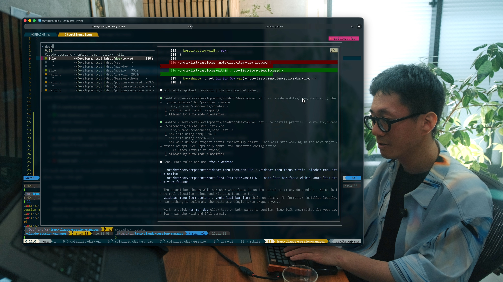

# tmux-claude-session-manager

[](https://youtu.be/NnTV6r4l5D0)

Run many [Claude Code](https://claude.com/claude-code) sessions across your
projects, each in its own tmux session — then **list them, see which are done
vs. still working, and jump to one** from a single popup.

If you launch Claude per-directory (one nested session per project), you quickly
end up with a dozen of them and no way to tell which are finished without opening
each one. This plugin gives you:

- 🔢 **A central picker** (`prefix` + `u`) listing every running Claude session.
- 🟢 **Live status** per session — `working` / `waiting` / `idle` — read straight
  from each session's screen every time the picker opens, so it's never stale and
  needs no setup.
- 👁️ **A live preview** of each session's screen right in the picker.
- 🎯 **Smart jump** — selecting a session switches your client to the window it
  was launched from, then resumes it in a popup over it.
- 🚀 **A launcher** (`prefix` + `y`) that opens/attaches a Claude session for the
  current directory.
- ❌ **Quick kill** (`ctrl-x`) of finished sessions from the picker.

Status works out of the box — no hooks required. The optional hooks below only
add a recency timestamp (the age column / "just finished" sorting).

## Prerequisites

- **tmux ≥ 3.2** (for `display-popup`)
- **[fzf](https://github.com/junegunn/fzf)** — the picker UI
- **[Claude Code](https://claude.com/claude-code)** CLI (the `claude` command)
- bash; macOS or Linux

## Install (tpm)

Add to `~/.tmux.conf` (or `~/.config/tmux/tmux.conf`):

```tmux
set -g @plugin 'craftzdog/tmux-claude-session-manager'
```

Then hit `prefix` + <kbd>I</kbd> to install.

> **Keybinding note:** by default the plugin binds `prefix` + `y` (launch) and
> `prefix` + `u` (list). If your config binds those elsewhere, either change the
> options below, or make sure the plugin loads **after** your own bindings (put
> `run '~/.tmux/plugins/tpm/tpm'` _after_ them) so the one you want wins.

### Manual install

```sh
git clone https://github.com/craftzdog/tmux-claude-session-manager ~/clone/path
```

Add to `~/.tmux.conf`, then reload (`prefix` + <kbd>r</kbd> or `tmux source ~/.tmux.conf`):

```tmux
run-shell ~/clone/path/claude_session_manager.tmux
```

## Usage

| Key              | Action                                                                          |
| ---------------- | ------------------------------------------------------------------------------- |
| `prefix` + `y`   | Launch (or re-attach to) a Claude session for the current directory, in a popup |
| `prefix` + `u`   | Open the session picker (all sessions)                                          |
| `prefix` + `C-u` | Open the picker scoped to the current pane's dir group (see below)               |

Inside the picker:

| Key                       | Action                                                                    |
| ------------------------- | ------------------------------------------------------------------------- |
| `enter`                   | Jump to the session (switches to its origin window, resumes in the popup) |
| `ctrl-x`                  | Kill the highlighted session                                              |
| `↑` / `↓`, type to filter | fzf navigation                                                            |

Sessions needing your attention (`waiting`, `idle`) sort to the top.

## Scoped picker (dir groups)

When you share your screen, you may not want every session in the list — e.g.
work for other clients. `prefix` + `C-u` opens the picker **hard-scoped** to the
dir group of the pane you're in — only that group's sessions are listed *and
previewed*, so nothing else can appear on screen. (It's a real filter at the
source, not fzf's type-to-filter, which would still flash the full list.)

The grouping key is the **parent directory** of a session's path — sessions live
at `…/<parent>/<project>`, so `…/acme/web` and `…/acme/api` are both in group
`acme`. To treat several parent dirs as one group, list them in
`@claude_dir_groups` (comma-separated groups, space-separated members); any dir
not listed is its own singleton group:

```tmux
# 'acme' and 'acme-labs' are one group; everything else stands alone
set -g @claude_dir_groups 'acme acme-labs'
```

The picker's header shows which dir group you're scoped to. Invoke `prefix` +
`C-u` from inside one of that group's sessions (or from a shell sitting in such a
project) so it can read the directory. Rebind it with `@claude_scoped_list_key`.

## Recency timestamps (optional)

The `working` / `waiting` / `idle` color is derived live from each session's pane
when the picker opens — no setup needed (see [How it works](#how-it-works)).

The optional [Claude Code hooks](https://code.claude.com/docs/en/hooks) below
only stamp a `@claude_state_at` timestamp on each session, which powers the **age
column** and the "just finished floats to the top" sorting. Without them, status
still works; the age column just shows `-`. Add the following to your Claude Code
settings (`~/.claude/settings.json`), merging into any existing `hooks` block.
Adjust the path if your plugins live elsewhere (e.g. `~/.tmux/plugins/...`):

```json
{
  "hooks": {
    "UserPromptSubmit": [
      {
        "matcher": "",
        "hooks": [
          {
            "type": "command",
            "command": "$HOME/.config/tmux/plugins/tmux-claude-session-manager/scripts/state.sh working"
          }
        ]
      }
    ],
    "Notification": [
      {
        "matcher": "permission_prompt",
        "hooks": [
          {
            "type": "command",
            "command": "$HOME/.config/tmux/plugins/tmux-claude-session-manager/scripts/state.sh waiting"
          }
        ]
      }
    ],
    "PreToolUse": [
      {
        "matcher": "AskUserQuestion",
        "hooks": [
          {
            "type": "command",
            "command": "$HOME/.config/tmux/plugins/tmux-claude-session-manager/scripts/state.sh waiting"
          }
        ]
      }
    ],
    "Stop": [
      {
        "matcher": "",
        "hooks": [
          {
            "type": "command",
            "command": "$HOME/.config/tmux/plugins/tmux-claude-session-manager/scripts/state.sh idle"
          }
        ]
      }
    ]
  }
}
```

Each event just refreshes the timestamp; the displayed color itself comes from
the live pane read, not from these events.

> Claude Code reloads `hooks` dynamically — no restart needed. Sessions that are
> already running start stamping timestamps on their next event once the hooks
> are added.

## Options

Set any of these before the plugin loads (defaults shown):

```tmux
set -g @claude_launch_key     'y'        # prefix key: launch/open for current dir
set -g @claude_list_key       'u'        # prefix key: open the picker
set -g @claude_scoped_list_key 'C-u'     # prefix key: open the picker scoped to the current dir group
set -g @claude_dir_groups      ''        # merge parent dirs into one group, e.g. 'linkbal linkbal-x'
set -g @claude_command        'claude'   # command run in new sessions
set -g @claude_session_prefix 'c-'       # tmux session name prefix
set -g @claude_popup_width     '90%'     # popup width
set -g @claude_popup_height    '90%'     # popup height
set -g @claude_bell           'on'       # ring the bell when a session waits ('off' to disable)
set -g @claude_status         'on'       # auto-add the waiting-count badge to status-right ('off' to disable)
set -g @claude_waiting_icon   '⏳'       # prefix for the status-bar waiting count
set -g @claude_waiting_style  'fg=colour231,bg=red,bold' # tmux style for the count (add ',blink', or 'none')
```

## Waiting alerts (optional)

Two ways to notice a backgrounded session that needs you:

**Terminal bell** — when a session starts `waiting` (a permission prompt or a
question), `state.sh` writes a `BEL` to every attached client's tty. That tty is
your SSH pty, so the bell travels back and rings your **local** terminal — not the
remote server — wherever you're attached from. It needs the `waiting` hooks (see
above) and is on by default; disable with `set -g @claude_bell 'off'`.

**Status-bar count** — a badge counting how many sessions are waiting is added to
`status-right` **automatically** (nothing is shown when none are). No config
needed; the plugin appends it for you, idempotently. Disable with
`set -g @claude_status 'off'`.

The count is derived live from each session's pane (same logic as the picker) and
refreshes on tmux's `status-interval`, so it never goes stale. It's emitted with a
tmux style (white-on-**red background**, bold by default) so it stands out;
customize it with `@claude_waiting_style` — e.g. add `,blink`, or set it to
`none` for no styling.

> A lower `status-interval` (e.g. `set -g status-interval 2`) makes both the count
> and `blink` feel more responsive. If you'd rather place the badge yourself
> (e.g. on `status-left`), set `@claude_status 'off'` and add
> `#(~/.tmux/plugins/tmux-claude-session-manager/scripts/status.sh)` where you want
> it.

## How it works

- The **launcher** creates a detached `c-<dir-name>` tmux session running
  `claude`, records the window it came from in `@claude_origin`, and attaches to
  it in a popup.
- The **picker** lists sessions matching the prefix and, for each, derives the
  `working` / `waiting` / `idle` status by reading the session's pane with
  `capture-pane` (the footer line — `esc to interrupt` → working, a
  `Do you want to proceed?` / `Esc to cancel` modal → waiting, else idle). This is
  read fresh on every open, so it can't go stale the way a cached hook state
  would. On selection it moves your client to the session's origin window before
  resuming it in the popup.
- The optional **hooks** only stamp `@claude_state_at` (used for the age column
  and recency sort); when a pane can't be read, the picker falls back to the
  hook-recorded `@claude_state`.
- Pressing `prefix` + `u` **from inside a session popup** detaches that popup
  first (closing it), then reopens the picker full-size on the outer host client —
  so you never end up with a cramped popup-in-popup.

## License

[MIT](LICENSE) © Takuya Matsuyama
